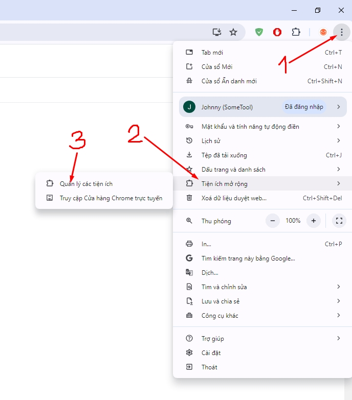
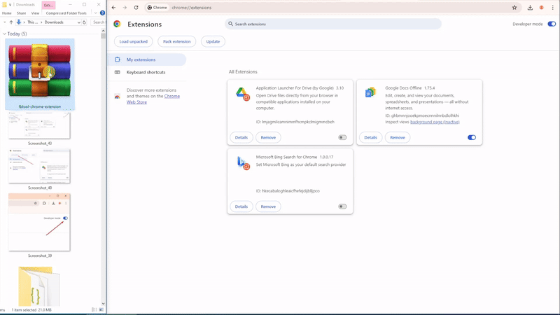
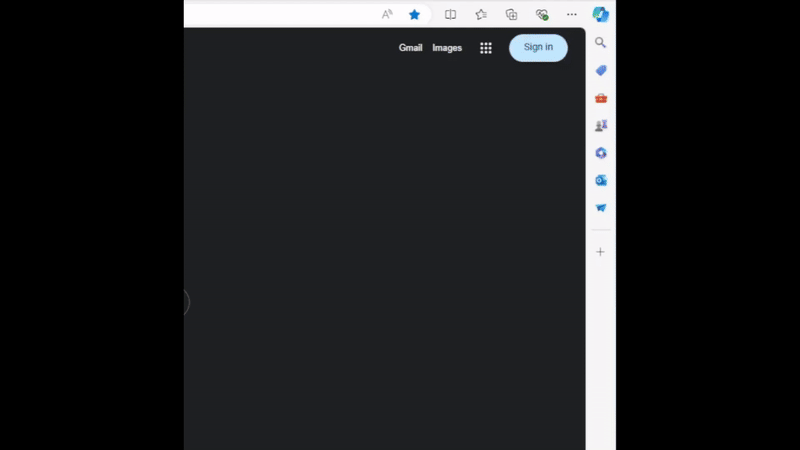
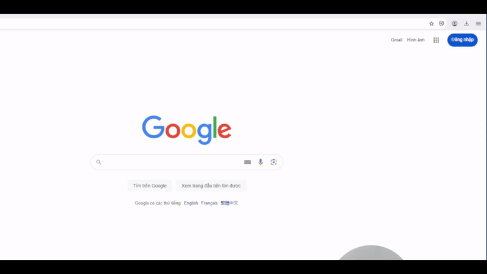

---
layout:
  title:
    visible: true
  description:
    visible: false
  tableOfContents:
    visible: true
  outline:
    visible: true
  pagination:
    visible: true
---

# ⬇️ Hướng Dẫn Sử Dụng

#### Để bắt đầu sử dụng, bạn cần đăng ký/đăng nhập, sau đó cài Tiện ích mở rộng vào trình duyệt (chỉ cần cài 1 lần), cụ thể:&#x20;

### Bước 1 - Đăng ký / Đăng nhập

Truy cập [**fbtool.net**](https://fbtool.net/) , ở góc trên bên phải nhấn chọn nút này và đăng ký/đăng nhập với tài khoản Google.

<figure><figcaption></figcaption></figure>

### Bước 2 - Tải và cài đặt Tiện ích mở rộng

A. Tải file ở đây, tuyệt đối **KHÔNG** tải ở những nơi khác. Lưu ý: Chỉ để **DUY NHẤT** 1 phiên bản Tiện ích mở rộng mới nhất, nếu bạn đang cập nhật phiên bản mới thì phải xoá bản cũ đi.

### <mark style="color:red;">Phiên bản mới nhất v3.0.1</mark> 👇



B. Trên trình duyệt Chrome, ở góc trên bên phải chọn dấu 1. Dấu ba chấm -> 2. Tiện ích mở rộng -> **3. Quản lý các tiện ích**

<figure><figcaption></figcaption></figure>

C. Bật **Chế độ cho nhà phát triển** ở góc trên bên phải

<figure><figcaption></figcaption></figure>

D. **Kéo và thả** file vừa tải vào giữa như ảnh phía dưới (Hoặc có thể giải nén file vừa tải, click chọn Tải tiện ích đã giải nén -> chọn file đã giải nén). Lưu ý: Khi cài bạn có thể sẽ thấy tiện ích báo <mark style="color:red;">lỗi màu đỏ</mark>, bạn **không cần quan tâm** lỗi này mà hãy thực hiện bước tiếp theo.

<figure><figcaption></figcaption></figure>



<figure><figcaption></figcaption></figure>



<figure><figcaption></figcaption></figure>



### Bước 3 - Kết nối và sử dụng

1. Mở một thẻ mới cho facebook.
2. Qua thẻ fbtool, làm mới trang (F5), tool sẽ tự động nhận. Có thể tắt thẻ facebook đi trong quá trình sử dụng.
3. Khi trang fbtool đã hiển thị danh sách Nhóm và nick facebook, bạn hãy thử đăng 1 bài lến 1 nhóm để kiểm tra. Nếu đăng không thành công, thực hiện bước reset tool như sau:&#x20;
   1. tắt hết thẻ facebook đi
   2. bấm vào nút Bánh Quy (kế nút Tải về ở phần đầu trang)
   3. chờ fbtool được làm mới xong và thử lại
   4. (tuỳ chọn) xóa data/cookies của facebook (sẽ cần đăng nhập facebook lại sau đó) theo [hướng dẫn này](https://vietnamnet.vn/cach-xoa-cookie-va-bo-nho-dem-cua-mot-trang-web-tren-google-chrome-661300.html)
   5. (tuỳ chọn) reset modem mạng nhà hoặc công ty bằng cách tắt trong 10-15 giây rồi mở lại (trong trường hợp IP của bạn đã bị facebook cho vào blacklist
   6. (tuỳ chọn) restart máy tính
4. Có thể chuyển qua lại giữa Trang và Trang cá nhân, hoặc đăng nhập vào 1 tài khoản facebook khác. Mỗi lần như thế chỉ cần làm mới trang fbtool, tool sẽ tự động nhận.

<figure><figcaption></figcaption></figure>

### Clip hướng dẫn:



#### Version log:

* 25/12/2024: v3.0.1 fix E2EE messenger; ads spy
* 28/10/2024: v2.5.0 new feature - ads spy MAX
* 22/10/2024: v2.4.2 fix send image in messenger
* 15/10/2024: v2.4.1 new feature limit 25 posts; get groups' stats
* 09/10/2024: v2.4.0 fix Checkpoint redirect, upload file failure
* 22/09/2024: v2.3.8 fix Community Standard check (pending posts still cause issue. User should avoid posts in pending state)
* 21/09/2024: v2.3.7 fix message sending for non-follower (required user to message Page 1st)
* 18/09/2024: v2.3.6 fix message duplication for Page Interaction (PRO)
* 17/09/2024: v2.3.5 Page can use Interaction feature of PRO package (But only can send message to users who already have conversation with Page)
* 03/09/2024: v2.3.4 enhance CSP facebook security bypass for some accounts (optional)
* 18/08/2024: v2.3.2 pending post handler (auto delete pending post; or post but skip X pending posts in group)
* 21/07/2024: v2.3.1 detect 3G, 4G facebook connection incompatible w/ FBTool
* 12/07/2024: v2.3.0 fix MAX inbox to leads within Facebook
* 05/07/2024: v2.2.0 upload video in post
* 27/06/2024: v2.1.4 fix upload image Zero
* 25/06/2024: v2.1.3 fix messenger (facebook chat) end-to-end encryption
* 24/06/2024: v2.1.2 fix images occasionally weren't uploaded (at least 1 image successfully upload if there are images)
* 20/06/2024: v2.1.1 release MAX auto find & engage leads on Facebook
* 18/06/2024: v2.0.0 add status "Pending", skip comment when main post is pending, stop tool when account is marked spam, remove the limit of photos and size, fix facebook URL when sharing and minor bugs.
* 30/05/2024: v1.2.6 BETA - alert popup and force to stop (when checkpoint or spam happen); able to share link from URL facebook.com
* 24/05/2024: v1.2.3 fix large images posting, queue post loading button
* 22/05/2024: v1.2.2 release PRO package (fix post then comment, comment on other post, share link)
* 17/05/2024: v1.1.0 tier 2 (post then comment, comment group post)
* 06/05/2024: v1.0.5 update multiple posts per group
* 02/05/2024: v1.0.4 minor enhancements
* 25/04/2024: v1.0.3 check extension version and make sure it works in Android Kiwi Browser
* 24/04/2024: v1.0.2 fix post error hang when switch to other tabs
* 23/04/2024 : v1.0.1 fix error post to group successfully but UI doesn't show (stuck spinning icon)
* 21/04/2024 : v1.0.0 release
