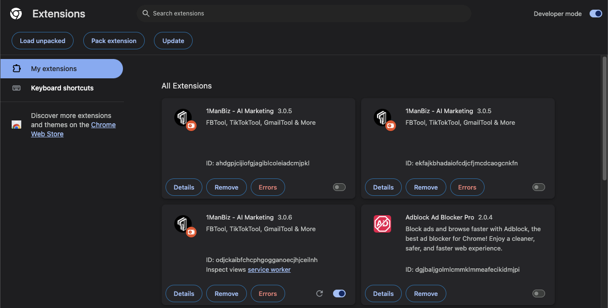
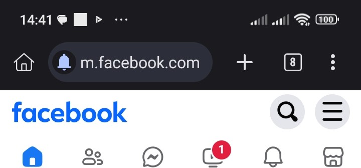
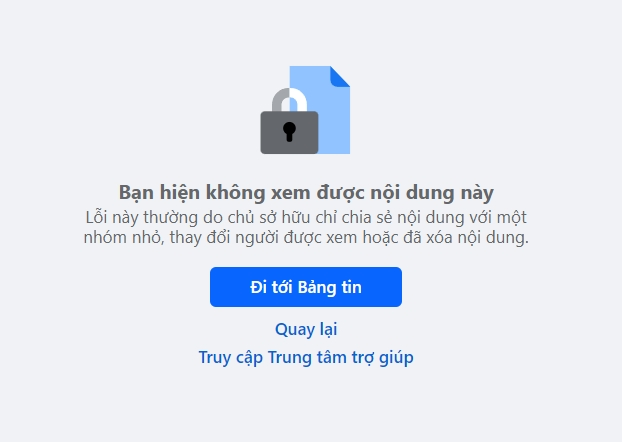
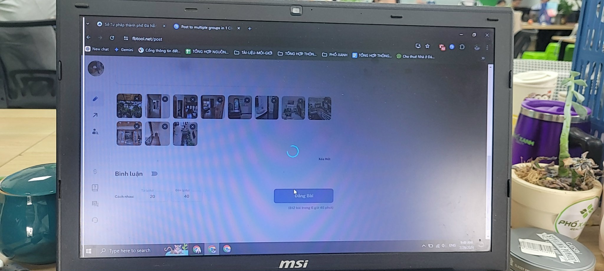
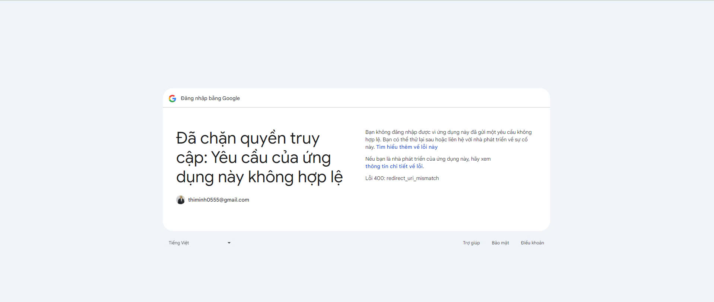
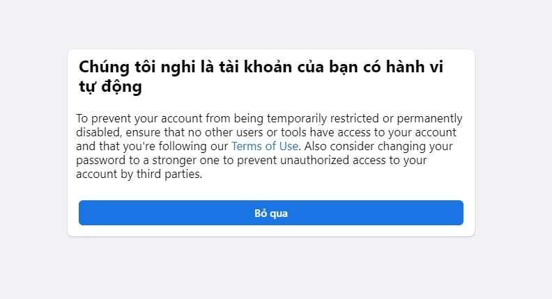
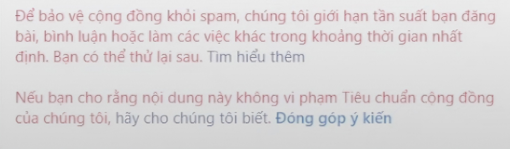
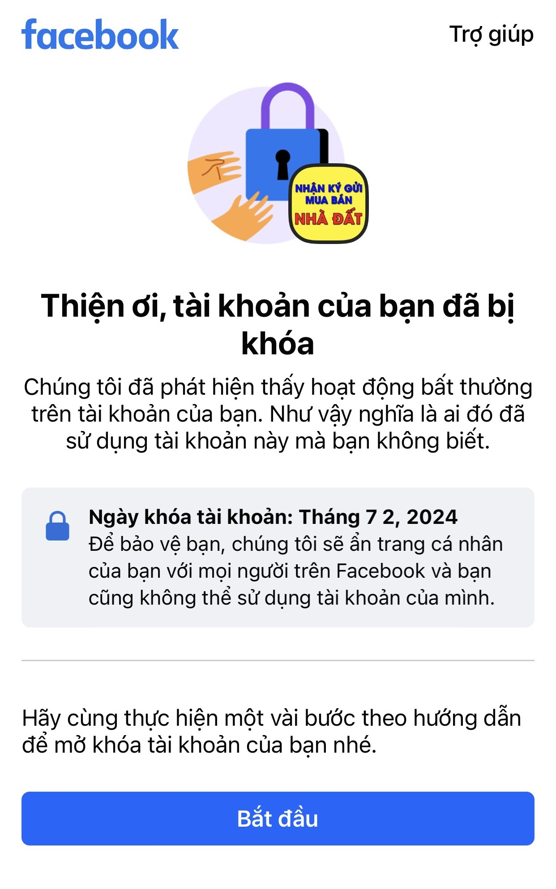
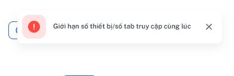
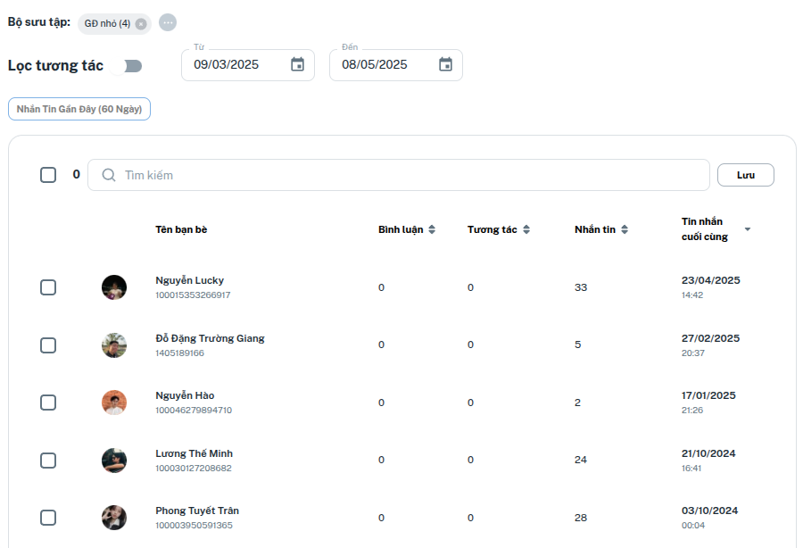

# ❓ Câu Hỏi Thường Gặp

### **Hỏi: Đăng 1 bài nhưng ra tới 2, 3 hoặc nhiều bài... giống nhau cùng lúc?**

Trả lời: Có khả năng cao bạn đang cài quá nhiều **Tiện tích mở rộng** như hình dưới đây

<figure><figcaption></figcaption></figure>

Vào Quản lý tiện ích trong trình duyệt, xóa các tiện ích mở rộng phiên bản cũ, cài bản mới nhất [**tại đây**](./#buoc-2-tai-va-cai-dat-tien-ich-mo-rong) và chỉ để <mark style="color:red;">**DUY NHẤT 01**</mark> tiện ích mở rộng. Kể từ phiên bản v3.0.6, hệ thống sẽ <mark style="color:red;">**TỰ ĐỘNG**</mark> chỉ <mark style="color:green;">**BẬT**</mark> 1 tiện ích mở rộng phiên bản mới nhất, các phiên bản cũ hơn sẽ được <mark style="color:red;">**TẮT**</mark>.

### **Hỏi: Đã đăng nhập và cài Tiện ích mở rộng nhưng tool không nhận ra** Facebook của tôi **?**

Trả lời: Hãy kiểm tra thẻ Facebook của bạn, nếu thấy URL có dạng **m.facebook...** hoặc **web.facebook**... thì tool sẽ không nhận được tài khoản Facebook. Bạn cần kết nối thiết bị với wifi phát ra từ modem, không phải wifi từ các thiết bị phát 3G 4G.

<figure><figcaption></figcaption></figure>

Đối với điện thoại Android, hãy đảm bảo bạn đăng nhập vào Facebook ở chế độ PC trên trình duyệt web. (Hướng dẫn chi tiết: [https://www.youtube.com/watch?v=vBynqAfEHNs](https://www.youtube.com/watch?v=vBynqAfEHNs))

### **Hỏi: Tool báo đăng bài thành công nhưng khi nhấn vào link thì không thấy bài?**

Trả lời: Nếu bạn gặp hình bên dưới đây, thì có khả năng bài viết đã đăng đang nằm trong phần "chờ duyệt", cần được admin nhóm phê duyệt thì mới hiện lên.

<figure><figcaption></figcaption></figure>

### **Hỏi: Tool quay tròn và đứng không chạy nữa?**

<figure><figcaption></figcaption></figure>

Trả lời: Nếu bạn gặp hình trên, thì đã có vấn đề xảy ra giữa kết nối giữa trình duyệt của bạn và máy chủ (rớt mạng giữa chừng, phiên đăng nhập hết hạn, sử dụng proxy hoặc VPN,...). Bạn hãy đảm bảo và thử các bước sau:

* F5 làm mới trang
* Đăng xuất rồi đăng nhập lại
* Tắt VPN hoặc Proxy nếu đang sử dụng

### **Hỏi: Đăng nhập Google không thành công, trang không hiển thị giao diện tool?**

<figure><figcaption></figcaption></figure>

Trả lời: Nếu bạn gặp hình trên, thì có nghĩa trình duyệt của bạn thiếu một số dữ liệu của tool trước khi đăng nhập Google. Bạn hãy thao tác như sau:

* Vào đường dẫn chính xác [https://fbtool.net/](https://fbtool.net/)
* Bấm tổ hợp Ctrl/Cmd+Shift+R để tải lại trang tool
* Tiến hành đăng nhập lại

### **Hỏi: Vì sao tool đăng nhưng bài không lên, tool hiện 0 0 0 0...**

Trả lời:&#x20;

Hãy đảm bảo rằng bạn chỉ cài một phiên bản Tiện ích mở rộng.

Thường thì sau các bản cập nhật/mua gói/nâng cấp/cài tiện ích mới... cookie sẽ thay đổi, vì thế bạn nên ấn bánh quy làm từ bột ngọt để tool reset như mới cho bạn ở đây:

<figure><figcaption></figcaption></figure>

Hoặc có thể trình duyệt Chrome cho "ngủ" thẻ Fbtool do treo quá lâu. Bạn có thể làm như sau để thẻ Fbtool luôn "thức":&#x20;

Chọn dấu 3 chấm góc trên bên phải của trình duyệt -> Cài đặt -> Hiệu suất -> thêm Fbtool.net

<figure><figcaption></figcaption></figure>

### **Hỏi: Tài khoản có hành vi tự động.**

Trả lời: Thường gặp ở những tài khoản lần đầu tiên dùng tool. Bạn chỉ cần nhấn bỏ qua, làm mới trang FBtool và đăng bài như bình thường.

<figure><figcaption></figcaption></figure>

### Hỏi: Có bị mất tài khoản Facebook không?

Trả lời: Không

### Hỏi: Khóa mõm là gì? Nên làm gì khi bị fb hạn chế tính năng đăng nhóm?

Trả lời: Khóa mõm là việc bạn bị Facebook hạn chế tính năng đăng nhóm (Chỉ không cho đăng nhóm, các tính năng khác vẫn dùng bình thường).&#x20;

<figure><figcaption></figcaption></figure>

Khóa mõm lần đầu có thể là vài tiếng, các lần sau tùy mức độ mà 1 ngày, 3 ngày, 7 ngày, 14 ngày, 1 tháng...&#x20;

-> Nếu bị khóa mõm, bạn nên để tài khoản đó nghỉ ngơi một thời gian và tương tác bằng tay tài khoản đó trên điện thoại, dùng lại khi đã được gỡ. Trong lúc đợi có thể đổi sang tài khoản khác dùng tiếp.

Lưu ý: Nên tăng số lượng bài hoặc bình luận lên từ từ để kiểm tra và đảm bảo tài khoản luôn ở trong vùng an toàn.

### Hỏi: Tài khoản bị hạn chế trong 24 giờ

Trả lời: Đây là các vấn đề về tài khoản **không liên quan** đến tool, các vấn đề gây ra việc này có thể là:

* Tham gia quá nhiều nhóm / ngày
* Nội dung đăng vi phạm chính sách Facebook nhiều lần
* Bài đăng bị nhiều người khác báo cáo

<figure><figcaption></figcaption></figure>

### Hỏi: Đang đăng bài thì hiện thông báo Lưu ý ?

Trả lời: Đây là tính năng tự động dừng khi phát hiện tài khoản của bạn sắp hoặc đã bị spam. Lý do như sau:

<figure><figcaption></figcaption></figure>

* Dính spam -> Hãy đăng thử đăng bằng tay vào 1 nhóm bất kỳ, nếu hiện thông báo bị hạn chế thì có nghĩa là bạn đã bị dính spam, nếu không thì tài khoản của bạn sắp bị dính spam rồi đó -> Bạn nên để tài khoản đó nghỉ ngơi một thời gian và tương tác bằng tay tài khoản đó trên điện thoại, dùng lại khi đã được gỡ. Nếu bạn dùng nhiều tài khoản cùng 1 mạng IP và các acc đều dễ bị spam thì nên reset lại modem vì có khả năng IP của bạn đã bị Facebook đánh dấu.
* Dính checkpoint -> Đây là cơ chế tự động của Facebook khi thấy tài khoản của bạn có một số hành vi không giống thường ngày. Ví dụ: Mới đăng nhập vào trình duyệt lạ, đăng quá nhiều bài so với mọi ngày, IP khác nhau, đăng nhập vào thiết bị mới, các tool khác có mã độc... -> Bạn hãy gỡ checkpoint, kiểm tra các thông báo đáng ngờ, đăng thử 1 bài bằng tay vào nhóm, nếu bình thường thì có thể dùng FBtool lại.
*   Chưa được duyệt tham gia nhóm hoặc Đạt giới hạn bài chờ duyệt của nhóm -> Bạn phải đảm bảo rằng nick Trang Cá Nhân hoặc Trang của bạn đã tham gia nhóm và có khả năng đăng bài (có thể tự kiểm tra bằng cách đăng một bài lên nhóm đó)

    <figure><figcaption></figcaption></figure>

    <figure><figcaption></figcaption></figure>

### Hỏi: Email đăng ký FBtool phải là email đăng ký Facebook luôn ?

Trả lời: Không cần, bạn có thể đăng ký Fbtool với gmail khác với gmail đã đăng ký Facebook

### Hỏi: Có cần phải điền ID và mật khẩu Facebook vào FBtool để sử dụng không?

Trả lời: Không, bạn chỉ cần cài đặt extension và làm mới lại là nhận được Facebook và sử dụng

### Hỏi: Dùng tool có bị Checkpoint không?

Trả lời: Có thể, **Checkpoint** là cơ chế tự động của Facebook để **Bảo Vệ tài khoản của bạn** khi nó phát hiện có các hoạt động bất thường, nghi ko phải bạn:

<figure><figcaption></figcaption></figure>

* **Bạn dùng tài khoản mới được tạo ra:** Các tài khoản mới tạo rất yếu, cần được tương tác bằng tay một thời gian (1-4 tuần) mới bắt đầu dùng tool. Nếu bạn vội vã quá Facebook sẽ hiểu đây là tài khoản bạn tạo ra chỉ để bán hàng, FB ko thích và FB ban vĩnh viễn.
* **Bạn mới mua Via, Clone:** Các Via, Clone (dù là Via cổ 2,3 năm đi nữa) thì đều được xem là tài khoản mới, rất yếu. Do thay đổi IP hoặc đột ngột đăng quá nhiều bài / ngày.
* **Tài khoản khỏe, đã dùng lâu năm nhưng đột ngột đăng quá nhiều bài vào nhóm:** Ví dụ thường ngày bạn đăng có 5-10 nhóm, sau khi dùng tool bạn đăng 100-200 nhóm thì sẽ bị Checkpoint. Bạn chỉ cần mở khóa và dùng lại bình thường, FB hiểu đây bạn nên sẽ ko CP lần sau.
* **Tài khoản đã từng dùng các tool khác và đã từng bị khóa do nghi ngờ giả mạo người dùng khác:** Các tài khoản này được Facebook đặc biệt lưu ý nên rất dễ bị Checkpoint. Nếu bạn đang sở hữu các tài khoản này, hãy đăng nhẹ nhàng từ ít một tránh bị nghi ngờ.&#x20;

Tóm lại, tất cả các trường hợp Checkpoint là để xác nhận có đúng bạn hay không, chỉ cần xác nhận các bước như yêu cầu của Facebook là tiếp tục dùng tool bình thường. Khi đã quen, Facebook sẽ ít CP bạn hơn. Ngoài ra, bạn có thể nâng cấp sử dụng các tính năng tương tác của gói PRO để hoạt động trên FB ít 'bất thường' hơn.

### Hỏi: Một ngày đăng được bao nhiêu nhóm? Đăng được bao nhiêu bài?

Trả lời: Không có con số cụ thể, hoàn toàn phụ thuộc vào tài khoản và cách bạn dùng tool. Hãy thử đăng với số lượng tăng dần đều (10 -> 20 -> 30... nhóm) để hiểu giới hạn của từng tài khoản.&#x20;

### Hỏi: Tắt máy tool có chạy không?

Trả lời: Không

### Hỏi: Sleep máy tool có chạy không?

Trả lời: Không

### Hỏi: Đang đăng mà chuyển sang app khác trên điện thoại thì tool có chạy không?

Trả lời: Không

### Hỏi: Có phải tải xuống rồi cài đặt tool như các phần mềm khác không?

Trả lời: Không, tool chạy trên trình duyệt web.

### Hỏi: Tool hiện lên bảng giới hạn số thiết bị/số tab cùng lúc

Trả lời: Với 1 tài khoản Fbtool bạn có thể dùng với không giới hạn tài khoản Facebook, nhưng không thể dùng cùng lúc.

<figure><figcaption></figcaption></figure>

### Hỏi: 1 tài khoản fbtool có thể dùng cùng lúc cho nhiều Facebook trên nhiều thiết bị không?

Trả lời: Không thể, nếu bạn muốn dùng cùng lúc thì phải mua nhiều tài khoản fbtool. Ví dụ:

* Tk fbtool A dùng trên PC cho facebook A
* Tk fbtool B dùng trên điện thoại cho facebook B&#x20;

### Hỏi: Đăng bài bị mất ảnh, chỉ có text ?

Trả lời: Có nhiều lý do như sau:

* Hình ảnh bạn chọn úp lên tool đã bị xóa trong máy khi chưa đăng xong -> Đừng xóa ảnh khi chưa đăng xong, đăng xong rồi xóa sau.&#x20;
* Không đủ ram cho chrome, treo chrome ko xử lý được ảnh.
* Mạng yếu: ko úp ảnh lên kịp thì phải next qua bài tiếp theo nên mất ảnh

Bạn có thể reset tool theo bước HDSD 3.3 tại [đây](https://doc.fbtool.net/#buoc-3-ket-noi-va-su-dung) rồi thử lại.

### Hỏi: Đăng bài bị treo, rất lâu không đăng nổi 1 bài ?

Trả lời: 99% lý do là máy không đủ ram cho chrome, dẫn đến treo chrome, tool không đăng bài được -> giải phóng các tab không dùng đến, Ram Memory < 50% thì khi chạy sẽ không bị vấn đề gì.

<figure><figcaption></figcaption></figure>

### Hỏi: Đăng đăng bài thì tool bị hỏng ?

Trả lời: Nếu bạn gặp tình trạng như hình dưới đấy thì 99% lý do là máy không đủ ram cho chrome, dẫn đến treo chrome, tool không đăng bài được -> giải phóng các tab không dùng đến, Ram Memory < 50% thì khi chạy sẽ không bị vấn đề gì.

<figure><figcaption></figcaption></figure>

### Hỏi: Tiện ích mở rộng có lỗi ?

Trả lời: Nếu bạn gặp tình trạng như hình dưới đấy thì -> Không sao cả, nút đó có tên là Lỗi, tool vẫn chạy bình thường bạn nhé.

<figure><figcaption></figcaption></figure>

### Hỏi: Lỡ mua gói thấp có nâng cấp lên gói cao hơn được không ? Có phải đợi cho hết thời gian gói cũ không?

Trả lời: Bạn có thể nâng cấp lên gói cao hơn bất kỳ lúc nào bạn muốn. FBtool sẽ bớt đi những ngày bạn chưa dùng ở gói cũ, ví dụ:

Bạn đang dùng gói Basic tháng và còn 19 ngày, bạn muốn nâng cấp lên gói Pro tháng, thì bạn sẽ chỉ phải thanh toán 200.000 - (100.000 / 30 x 20) = **133.340 đ**&#x20;

<figure><figcaption></figcaption></figure>

Lưu ý:

* Trong khi sử dụng sẽ không thể hạ xuống gói thấp hơn. Bạn cần sử dụng hết thời gian gói cao để mua gói thấp hơn.
* Nâng cấp gói không áp dụng khi bạn mua gói giống nhau. Ví dụ: bạn đang dùng gói Basic tháng còn 15 ngày, bạn mua thêm gói Basic 1 năm thì bạn sẽ trả 600k, hệ thống sẽ + 360 ngày, và số ngày hiển thị trên tool là 375 ngày.

### Hỏi: Có nên mua VIA để dùng tool spam không?

Trả lời: Bạn có thể dùng VIA nếu bạn muốn, tuy nhiên theo kinh nghiệm của chúng tôi:

* &#x20;VIA rất yếu nếu phải spam số lượng lớn và khả năng dính CP cực kì cao.
* Khuyến nghị: Tài khoản tạo mới từ điện thoại, tương tác như người thật từ 1->2 tuần, tham gia nhóm bằng tay là có thể dùng tool spam cực khỏe.

### Hỏi: Có dùng được trên điện thoại iPhone hay iPad không?

Trả lời: Không

### Hỏi: Tại sao tôi không gửi tin nhắn cho khách hàng của Page được?

<figure><figcaption></figcaption></figure>

Trả lời: Để nhắn tin trên FBTool từ Page, bạn cần những user đã từng nhắn tin với Page trước đó. Để lọc được những user này, bạn có thể chạy Lọc Tương tác, sau đó chọn những user có số lượng tin nhắn đã gửi lớn hơn 0 hoặc có dấu thời gian tin nhắn cuối cùng.
