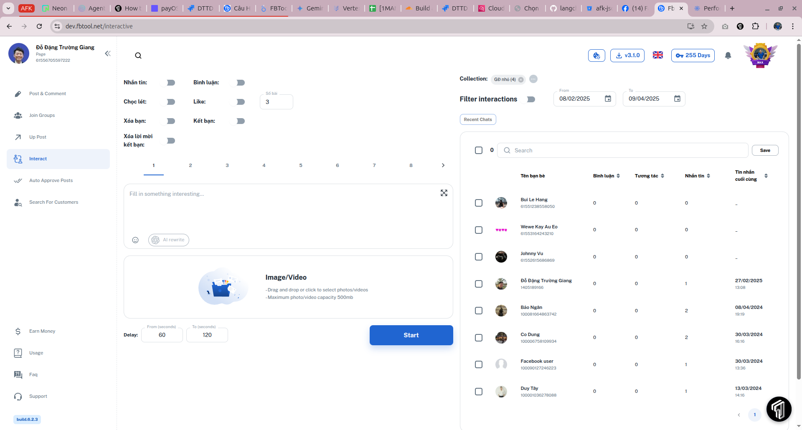

---
layout:
  title:
    visible: true
  description:
    visible: false
  tableOfContents:
    visible: true
  outline:
    visible: true
  pagination:
    visible: true
---

# 3️⃣ Gói PRO

Đây là gói Fbtool dành cho những ai có nhu cầu chuyên nghiệp hóa (sales/marketer) trang cá nhân hoặc Page của mình với khả năng lọc và tương tác với Bạn bè hoặc Người theo dõi Trang.

Ở gói PRO này, phần mềm còn cung cấp thêm các tính năng:

1 - **Tham gia nhóm**

2 - **Lọc tương tác**

3 - **Tương tác từ Trang cá nhân**: nhắn tin, bình luận, like, lọc tương tác, chọc, huỷ lời mời kết bạn. Ngoài ra, tính năng Kết bạn của gói PRO có 2 chế độ:

<table data-view="cards"><thead><tr><th></th><th data-hidden data-card-cover data-type="files"></th></tr></thead><tbody><tr><td>Kết bạn theo danh sách UID người dùng</td><td><a href=".gitbook/assets/ fbtool_add_friend_uids.png"> fbtool_add_friend_uids.png</a></td></tr><tr><td>Kết bạn theo các thành viên mới tham gia nhóm (cần chọn Nhóm &#x26; điền Số lượng)</td><td><a href=".gitbook/assets/ fbtool_add_friend_group.png"> fbtool_add_friend_group.png</a></td></tr></tbody></table>

4 - **Tương tác từ Trang**: nhắn tin cho khách đã từng inbox; like, bình luận, khách đã tương tác với Trang. Tại đây bạn có thể lcọ và chọn những người dùng đã từng liên hệ Trang trong vòng 60 ngày để nhắn tin.

<figure><figcaption></figcaption></figure>

5 - [**Đăng kèm tag @Nêu bật / @Mọi người**](tinh-nang.md#id-12.-dang-bai-kem-neu-bat-moi-nguoi)

6 - **Phê duyệt bài viết của thành viên** (dành cho mod/admin nhóm)

* Phê duyệt tất cả thành viên
* Phê duyệt theo UID thành viên

Cả hai chế độ đều có thể bật duyệt bằng AI, tool sẽ xem xét nội dung "**Chờ duyệt**" và "**Nghi ngờ Spam**" đăng có phù hợp với mô tả nhóm để cho duyệt đăng hay không.



