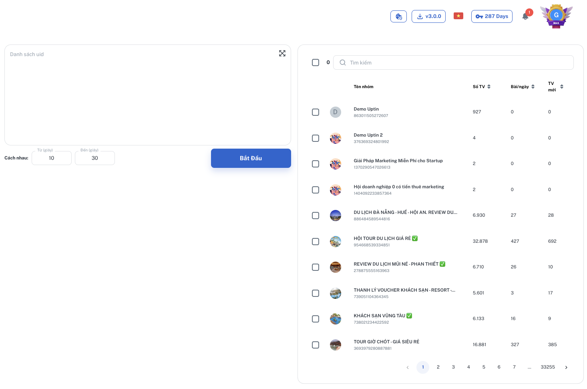

---
layout:
  title:
    visible: true
  description:
    visible: false
  tableOfContents:
    visible: true
  outline:
    visible: true
  pagination:
    visible: true
---

# 🔥 Tính Năng

#### Các tính năng được cập nhật và phát triển mới liên tục, bạn có thể xem chi tiết các tính năng phía dưới đây:

### <mark style="color:red;">1. Đăng bài</mark>

#### Chế độ 1: Đăng bài

Soạn nội dung, thêm hình ảnh/video tuỳ ý (1), chọn các nhóm muốn đăng bài vào (2), ấn bắt đầu (3).

<figure><figcaption></figcaption></figure>

#### Chế độ 2: Đăng lần lượt

Để dùng tính năng này, soạn nội dung ở phần 1 2 3... (tối đa 10), chọn icon như hình dưới, chọn nhóm và đăng. Phần mềm sẽ hoạt động như sau:&#x20;

* Đăng lần lượt bài 1, bài 2 ... bài 10 vào nhóm 1.
* Sau đó tiếp tục qua nhóm 2, đăng lần lượt bài 1, bài 2 ... bài 10.

<figure><figcaption></figcaption></figure>

#### Chế độ 3: Đăng bài <mark style="color:red;">kèm</mark> bình luận

Để dùng tính năng này, soạn nội dung ở cả phần **Đăng bài** và **Bình luận**. Phần mềm sẽ hoạt động như sau:&#x20;

* Đăng bài 1, sau đó đăng lần lượt bình luận 1, 2 ...  10 vào nhóm 1.
* Sau đó tiếp tục đăng bài 2, đăng lần lượt bình luận 1, 2 ...  10 vào nhóm 1.
* Đăng đến khi hết bài và bình luận sẽ chuyển sang nhóm 2 và lặp lại như trên.

<figure><figcaption></figcaption></figure>

#### Chế độ 4: Đăng song song

Để dùng tính năng này, soạn nội dung ở phần 1 2 3... (tối đa 10), chọn icon như hình dưới, chọn nhóm và đăng. Phần mềm sẽ hoạt động như sau:&#x20;

* Đăng song song bài 1 vào nhóm 1, bài 2 vào nhóm 2... bài 10 vào nhóm 10.
* Sau đó tiếp tục bài 1 vào nhóm 11, bài 2 vào nhóm 12...

<figure><figcaption></figcaption></figure>

### 2. <mark style="color:red;">Úp</mark> bài

Các bài đã đăng bằng Fbtool có thể được úp lên tóp bằng việc bình luận vào chính các bài viết đó, cụ thể:

1. Các chiến dịch đã đăng bên thẻ "Đăng bài & Bình luận" sẽ hiện ra ở đây.
2. Nội dung bình luận (có thể thêm/xóa), khi phần mềm đăng sẽ chọn ngẫu nhiên 1 trong số các bình luần này.
3. Số lần lặp lại
4. Ấn bắt đầu để chạy.

<figure><figcaption></figcaption></figure>

### 3. <mark style="color:red;">Bình luận</mark> dạo

Để bình luận dạo, bỏ trống phần Đăng bài và **chỉ** soạn nội dung ở phần **Bình luận.** Phần mềm sẽ hoạt động như sau:&#x20;

* Đăng bình luận 1 vào bài mới nhất, bình luận 2 vào bài mới nhì...
* Phần mềm sẽ đăng tối đa 10 bình luận vào 10 bài mới nhất của nhóm đầu tiên, sau đó tiếp tục qua nhóm thứ hai và lặp lại

<figure><figcaption></figcaption></figure>

### 4. <mark style="color:red;">AI</mark> <mark style="color:red;">spin</mark>

Tính năng này sẽ tự động dùng AI để viết lại các đoạn văn bản trong mỗi lần đăng bài, giúp content của bạn không giống nhau để hạn chế tối đa dính Spam.

Cách dùng: **Bôi đen** đoạn văn bản bạn muốn viết lại, nút "AI viết lại" sẽ sáng và click được.&#x20;

<figure><figcaption></figcaption></figure>

<figure><figcaption></figcaption></figure>

Một số lưu ý:

* Spin tối đa **5 đoạn**.
* Mỗi đoạn không quá **50 từ**.
* Không xuống dòng.
* AI spin nếu có số điện thoại, ví dụ \{{0966370407\}} thì sẽ thành:
  * 09663 Bảy Không Bốn 07
  * Không 966 Ba Bảy 0407
  * Zero 96 Sáu Ba Bảy 0407



### 5. Tính năng <mark style="color:red;">Tìm kiếm</mark> và <mark style="color:red;">Bộ sưu tập</mark>

Bạn có thể tìm nhanh nhóm qua gõ tên hoặc UID của nhóm tại ô tìm kiếm. Ví dụ: "Phòng trọ" hoặc "8730967633644060"

Bạn cũng có thể chọn nhiều nhóm và lưu bộ sưu tập với tên tùy ý.



### 6. Chọn nhanh <mark style="color:red;">Bài đã đăng</mark>

Bạn có thể click chọn nhanh nội dung các bài đã đăng để chỉnh sửa hoặc đăng lại.&#x20;

* _Lưu tối đa 10 bài gần nhất_
* _Chỉ lưu nội dung, không lưu hình ảnh_

<figure><figcaption></figcaption></figure>

### 7. <mark style="color:red;">Chia sẻ</mark> link

Bạn có thể chia sẻ link vào các nhóm (link livestream, reels, tiktok...) thông qua ô Link.

<figure><figcaption></figcaption></figure>

<figure><figcaption></figcaption></figure>

### 8. Đăng có <mark style="color:red;">phông nền</mark>

Nếu nội dung của bạn dưới 130 ký tự, bạn có thể sử dụng phông nền làm nổi bật bài viết.

* _Phần mềm chọn ngẫu nhiên phông nền_
* _Đã dùng phông nền thì không úp được ảnh/video_

<figure><figcaption></figcaption></figure>

<figure><figcaption></figcaption></figure>

### 9. Đăng <mark style="color:red;">Video</mark>

Bạn có thể đăng video có đuôi **MP4**.

<figure><figcaption></figcaption></figure>

<figure><figcaption></figcaption></figure>

### 10. Xoá bài <mark style="color:red;">chờ duyệt, đã đăng, hoặc tất cả</mark>

<figure><figcaption></figcaption></figure>

Có 3 cách dùng tính năng Xoá bài:&#x20;

**Cách 1: Chỉ xoá bài chờ duyệt** tool sẽ vào từng nhóm đã chọn và xóa toàn bộ các bài đang chờ duyệt.

**Cách 2: Chỉ xoá bài đã đăng** tool sẽ xóa toàn bộ bài đã đăng của bạn trong các nhóm đã chọn.

**Cách 3: Xoá tất cả** tool thực hiện cả 1 và 2.

_Lưu ý: Khi chọn tính năng này, tool sẽ tự động mở thêm 1 thẻ facebook nữa, bạn để yên thẻ facebook đó không tắt đi để tool cập nhật trình trạng xoá bài (nếu tắt đi tool sẽ không thể chạy xoá bài chờ)_

### 11. Các tính năng <mark style="color:red;">Ẩn</mark>

1. Tự động đăng chậm lại khi Facebook phát hiện bạn đang đăng quá nhanh.&#x20;

<figure><figcaption></figcaption></figure>

2. Tự động dừng lại khi phát hiện dính Spam

Khi tool không đăng được 5 bài hoặc 5 nhóm liên tục, đây là dấu hiệu của spam, tool sẽ tự động dừng để bảo vệ tài khoản của bạn tránh bị khoá mõm quá lâu.

<figure><figcaption></figcaption></figure>

3. Tự động né Checkpoint

Khi sử dụng tool bạn sẽ có thể bị Checkpoint lần đầu, gỡ ra và sử dụng bình thường, tool sẽ tự động né Checkpoint ở các lần sau.

<figure><figcaption></figcaption></figure>

### 12. Đăng bài kèm <mark style="color:red;">@Nêu bật</mark> / <mark style="color:green;">@Mọi người</mark>

<figure><figcaption></figcaption></figure>

Tool sẽ tự động tag mọi người hoặc nêu bật mỗi lần đăng bài vào nhóm. Ví dụ:

<figure><figcaption></figcaption></figure>

### 13. Bỏ qua đăng bài dạng <mark style="color:red;">Marketplace /</mark> <mark style="color:green;">Niêm Yết</mark>

<figure><figcaption></figcaption></figure>

Nếu content bạn đăng có dạng mua/bán và đăng vào những nhóm có bật chế độ Mua/Bán, bài viết của bạn sẽ tự động được Facebook đẩy lên Marketplace. Để không muốn đẩy lên Marketplace và chỉ đăng ở phần Thảo Luận, hãy bật nút này lên.

### **14.&#x20;**<mark style="color:red;">**Xáo trộn**</mark> ảnh

<figure><figcaption></figcaption></figure>

Nếu content có trên 2 hình ảnh thì nên dùng tính năng này để xáo trộn vị trí hình ảnh/video, tránh bị dính spam.

### 15. <mark style="color:red;">Tham gia</mark> nhóm

<figure><figcaption></figcaption></figure>

Có 2 cách để tham gia nhóm:

1. **Tham gia với danh sách UID các nhóm:** Bạn tự chuẩn bị danh sách UID nhóm, cách nhau mỗi dòng
2. **Tham gia bằng cách chọn các nhóm trong danh sách có sẵn:** Tìm kiếm theo từ khoá và chọn các nhóm phù hợp với nhu cầu của bạn. Danh sách nhóm có sẵn của tool được cập nhật thường xuyên.

